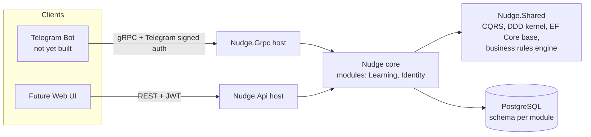

# Nudge — Architecture

## 1. Product vision

Nudge is a **personal spaced-repetition and reminder tool**, multi-user from day one.

A user creates **Decks** (e.g. "History", "English words") and fills them with **Cards** — personal
notes or question/answer pairs. Cards are scheduled for review using the **SM-2 (Anki-style)
spaced-repetition algorithm**. When cards fall due, the user is nudged through a **Telegram bot**
with a cross-deck review session ("Do you remember...?"), and answers feed back into the
scheduling algorithm.

Primary use cases:
- Personal knowledge retention ("don't forget this").
- Language learning (vocabulary decks).
- Lightweight journaling/notes that resurface themselves over time.

The bot is the primary client. A REST API exists alongside it for administration, manual testing,
and as the seam for a possible future web UI — both surfaces sit in front of the same domain core.

## 2. Tech stack matrix

| Concern | Choice | Notes |
|---|---|---|
| Runtime | .NET 10 | `src/Nudge.slnx` |
| API (bot transport) | gRPC (`Nudge.Grpc`) | Real transport for the Telegram bot |
| API (admin/future web) | ASP.NET Core Minimal APIs, REST (`Nudge.Api`) | Swagger/OpenAPI enabled |
| Database | PostgreSQL, single database | **schema-per-module** (e.g. `learning`, `identity`) |
| ORM | EF Core | snake_case tables/columns, soft-delete query filter, optimistic concurrency via `Version` |
| Messaging/CQRS | Custom `ICommand`/`ICommandHandler` (MediatR-style) | `Nudge.Shared.Core.CQRS` |
| Mapping | Mapster / MapsterMapper | DTO ↔ Command ↔ Domain |
| Validation | FluentValidation (request shape) + custom Business Rules Engine (domain invariants) | Two distinct layers — see §6 |
| IDs | Snowflake IDs wrapped in strongly-typed ID value objects | `DeckId`, `CardId`, etc. |
| Domain modeling | DDD tactical patterns: `Aggregate<TId>`, `Entity<TId>`, value objects | `Nudge.Shared.Core.Model` |
| Auth (bot ↔ backend) | Backend verifies Telegram's signed auth payload on every gRPC call | No blind trust of the bot process |
| Auth (REST/web) | Telegram Login Widget → backend verifies → self-issued JWT | Single identity source (Telegram) across bot and web |
| Secrets | `dotnet user-secrets` (dev), env vars / Docker secrets (self-hosted prod) | Never committed; portable to a cloud secret store later |
| Logging | Serilog, structured | Console sink (dev/containers) + rolling file sink (self-hosted) |
| Observability | OpenTelemetry (traces + infra metrics) | Console exporter now → self-hosted Grafana/Tempo/Loki/Prometheus later → cloud-native exporter on cloud migration |
| Migrations | EF Core, **auto-applied on startup** | Same behavior in dev and prod (simplest for self-hosted) |
| Testing | xUnit, unit tests only for now | Domain logic (aggregates, business rules, SM-2) — no integration tests yet |
| Deployment | Self-hosted Docker Compose first | Postgres + `Nudge.Api` + `Nudge.Grpc` + bot behind a TLS-terminating reverse proxy (Caddy/Traefik); designed to migrate to managed cloud infra later |

## 3. High-level architecture



Both hosts (`Nudge.Api`, `Nudge.Grpc`) reference the same `Nudge` core project — they are two
transports over one domain, not two separate domains. This keeps the system a **modular monolith**:
one deployable unit today, with module boundaries clean enough to split into services later if ever
needed.

## 4. Modules and domain model

### 4.1 Learning module (`src/api/Nudge/Learning`) — exists today

Owns the `learning` Postgres schema (`LearningDbContext`).

| Aggregate/Entity | Fields | Notes |
|---|---|---|
| `Deck` (aggregate) | `Id: DeckId`, `Title: DeckTitle`, `Description: DeckDescription?`, `IsArchived: bool`, `Cards: IReadOnlyList<CardId>` | Created via `Deck.Create(...)`, validated by business rules |
| `Card` | `Id: CardId` (started, not yet a full feature) | Needs: content/question/answer fields, SM-2 scheduling state, owning `DeckId` |

**Planned additions**: `UserId` ownership on `Deck` (and transitively `Card`) once the Identity
module lands (§4.2); a `ReviewSession`/scheduling concept implementing SM-2 (next-review date,
ease factor, interval, repetition count per card).

### 4.2 Identity module (`src/api/Nudge/Identity`) — planned, not yet built

Owns an `identity` Postgres schema. Introduced because Nudge is **multi-user from the start**.

| Aggregate/Entity | Fields (proposed) | Notes |
|---|---|---|
| `User` (aggregate) | `Id: UserId`, `TelegramUserId: long`, timestamps | Identity is keyed by Telegram user ID; no password store |

Every module that owns user data (starting with `Learning.Deck`) references `UserId` as a foreign
key, not a navigation property — modules stay decoupled at the data layer, consistent with the
schema-per-module boundary.

## 5. Folder structure

```
src/
  Nudge.slnx
  api/
    Nudge.Api/          # REST host (Minimal APIs, Swagger) — admin/testing/future web
    Nudge.Grpc/          # gRPC host — the Telegram bot's real transport
    Nudge/                # domain + application core, referenced by both hosts
      Learning/           # bounded-context module
        Models/           # aggregates/entities
        ValueObjects/      # DeckId, DeckTitle, DeckDescription, ...
        BussinessRules/    # IBusinessRule implementations (see naming note below)
        Data/
          Configurations/  # EF Core IEntityTypeConfiguration<T>
          LearningDbContext.cs
        Features/          # vertical slices — see backend rules
          CreateDeck/
            V1/
              CreateDeckEndpoint.cs
              CreateDeckHandler.cs
          DeckMappings.cs
          DecksApiPaths.cs
        Extensions/
      Identity/            # planned — same shape as Learning
  shared/
    Nudge.Shared/          # cross-cutting kernel, no domain knowledge
      Core/
        Api/               # IMinimalEndpoint, MinimalApiExtensions, ValidationFilter, ApiPaths
        CQRS/              # ICommand, ICommandHandler
        Model/             # Aggregate<TId>, Entity<TId>, IAggregate, IEntity
        BusinessRulesEngine/
        Event/
        Exception/         # CustomException
        Utils/             # IIdGenerator, SnowflakeIdGeneratorAdapter, TypeProvider
      EFCore/               # AppDbContextBase, snake_case + soft-delete conventions
      Mapster/
      OpenApi/
```

**Naming note**: the existing folder is spelled `BussinessRules` (typo). New modules should use the
correct spelling `BusinessRules`; the existing `Learning` folder is left as-is until it's next
touched, to avoid unrelated churn in an unrelated change.

## 6. Cross-cutting conventions

- **CQRS pipeline**: every write goes through a `ICommand` → `ICommandHandler` pair. Endpoints map
  request DTOs to commands via Mapster, dispatch through the custom mediator, and map the result
  back to a response DTO.
- **Two validation layers, not one**:
  1. **FluentValidation** on the request DTO — checks shape/presence (e.g. "title is required and
     ≤ N chars"), enforced via `ValidationFilter` / `.WithValidation<T>()` at the API boundary.
  2. **Business Rules Engine** (`IBusinessRule` + `BusinessRuleValidator.Validate(...)`) — enforces
     domain invariants inside aggregate factory/behavior methods (e.g.
     `DeckTitleShouldBeLessThanNCharacters`), throwing `BusinessRuleValidationException`.
- **Aggregates are DDD-strict**: private setters, construction only through static factory
  methods, invariants enforced via business rules rather than ad hoc `if`/`throw`.
- **Persistence conventions** (`AppDbContextBase`, `EFCoreExtensions`): snake_case tables/columns
  (`ToSnakeCaseTables`), soft delete via `IsDeleted` + a global query filter
  (`FilterSoftDeletedProperties`, bypass explicitly with `.IgnoreQueryFilters()`), optimistic
  concurrency via a `Version` column bumped on every update, `CreatedBy`/`LastModifiedBy` audit
  fields (currently hardcoded to `0` — see Known gaps).
- **Error handling**: domain/business errors are `CustomException` (carries an `HttpStatusCode`)
  or `BusinessRuleValidationException`; request-shape errors are FluentValidation failures mapped
  to 400 by `ValidationFilter`. A central exception-handling layer should map these consistently to
  `ProblemDetails` on REST and to gRPC status codes on gRPC (not yet implemented — see Roadmap
  Phase 0).

## 7. Auth flows

- **Bot → gRPC**: the bot calls the gRPC backend, passing Telegram's signed auth payload (the
  same HMAC-signed data Telegram issues for bot/WebApp auth) with each call. The backend
  **independently verifies the signature** rather than trusting the bot's claimed user ID —
  defense in depth in case the bot process is ever compromised.
- **Web → REST**: user authenticates via the **Telegram Login Widget**; the backend verifies
  Telegram's signed payload once and issues its **own JWT** for subsequent REST calls. One
  identity source (Telegram) across both clients — no separate password store anywhere in the
  system.

## 8. Observability

- **Logging**: Serilog, structured (JSON), console sink always on, rolling file sink for
  self-hosted persistence.
- **Tracing/metrics**: OpenTelemetry SDK instrumenting HTTP, gRPC, and EF Core out of the box.
  Exporter starts as console (matches the existing dev note in `log/20260824_log.txt`), moves to a
  self-hosted Grafana + Tempo + Loki + Prometheus stack once self-hosting is real, and swaps again
  to a cloud-native exporter if/when the system migrates to managed cloud infra. No custom domain
  metrics for now — infra-level (request rate/errors/duration, DB query time) only.

## 9. Deployment topology

**Phase 1 (self-hosted)**: Docker Compose on a single VPS/home server —
`postgres` + `nudge-api` + `nudge-grpc` + the Telegram bot, all behind a TLS-terminating reverse
proxy (Caddy or Traefik). Secrets via environment variables / Docker secrets.

**Later (cloud)**: same containers, lifted onto managed cloud infra (managed Postgres, container
hosting, cloud secret store, cloud-native observability exporter). The design deliberately avoids
self-hosted-only dependencies so this migration is a lift, not a rewrite.

## 10. Known gaps / technical debt (tracked, not blocking)

- `CreateDeckEndpoint.cs` has `// todo: add authorization` — resolved by the Identity module +
  auth work in Roadmap Phase 1.
- `AppDbContextBase.OnBeforeSaving` hardcodes `userId = 0` pending a real current-user provider —
  same Phase 1 dependency.
- No EF Core migrations, Docker Compose, or connection configuration exist yet.
- No `Nudge.Bot` project exists yet in the repo.
- `Card` model is a stub — no create/update features yet, no scheduling state.
- `BussinessRules` folder name typo in `Learning` — leave as-is until touched; spell new modules'
  equivalent folder correctly.
